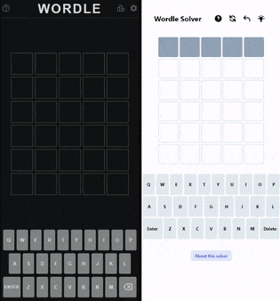

# Wordle Solver

This is a solver for [Wordle](https://www.powerlanguage.co.uk/wordle/). The UI is forked from [hannahcode/wordle](https://github.com/hannahcode/wordle).



## How it works

### Generating Possible Solutions

It simply runs through [all the possible solutions](https://github.com/azaky/wordle/blob/main/src/constants/wordlist.ts) and check which ones satisfy the colors. There are "only" over 2000 words, so it can run pretty fast on the browser.

### Generating Guess Suggestions

It checks [all the possible valid words](https://github.com/azaky/wordle/blob/main/src/constants/validGuesses.ts) and use [minimax algorithm](https://en.wikipedia.org/wiki/Minimax) to ensure that the worst case possible for the next response is the best one. In other words, it tries to reduce the maximum number of possible solutions on the next guess.

On [Absurdle](https://qntm.org/files/wordle/index.html), it is almost guaranteed to solve in 5 moves.

TODO: However, this approach is very CPU-intensive, especially for the early stage where the set of valid solutions are still large. It may take 2-4 seconds on early guesses.

---

Original README below

---

# Wordle Clone

- Go play the real Wordle [here](https://www.powerlanguage.co.uk/wordle/)
- Read the story behind it [here](https://www.nytimes.com/2022/01/03/technology/wordle-word-game-creator.html)
- Try a demo of this clone project [here](https://wordle.hannahmariepark.com)

_Inspiration:_
This game is an open source clone of the immensely popular online word guessing game Wordle. Like many others all over the world, I saw the signature pattern of green, yellow, and white squares popping up all over social media and the web and had to check it out. After a few days of play, I decided it would be great for my learning to try to rebuild Wordle in React!

_Design Decisions:_
I used a combination of React, Typescript, and Tailwind to build this Wordle Clone. When examining the original Wordle, I assumed the list might come from an external API or database, but after investigating in chrome dev tools I found that the list of words is simply stored in an array on the front end. I'm using the same list as the OG Wordle uses, but watch out for spoilers if you go find the file in this repo! The word match functionality is simple: the word array index increments each day from a fixed game epoch timestamp (only one puzzle per day!) roughly like so:

```
WORDS[Math.floor((NOW_IN_MS - GAME_EPOCH_IN_MS) / ONE_DAY_IN_MS)]
```

React enabled me to componentize the littlest parts of the game - keys and letter cells - and use them as the building blocks for the keyboard, word grid, and winning solution graphic. As for handling state, I used the built in useState and useEffect hooks to track guesses, whether the game is won, and to conditionally render popups.

In addition to other things, Typescript helped ensure type safety for the statuses of each guessed letter, which were used in many areas of the app and needed to be accurate for the game to work correctly.

I implemented Tailwind mostly because I wanted to learn how to use Tailwind CSS, but I also took advantage of [Tailwind UI](https://tailwindui.com/) with their [headless package](https://headlessui.dev/) to build the modals and notifications. This was such an easy way to build simple popups for how to play, winning the game, and invalid words.

_To Run Locally:_
Clone the repository and perform the following command line actions:

```bash
$ cd wordle
$ npm install
$ npm run start
```

### I'm looking for a junior developer role

Please feel free to contact me on [linkedin](https://www.linkedin.com/in/hannahpark1000/) and learn more about me [here](https://www.hannahmariepark.com/)
